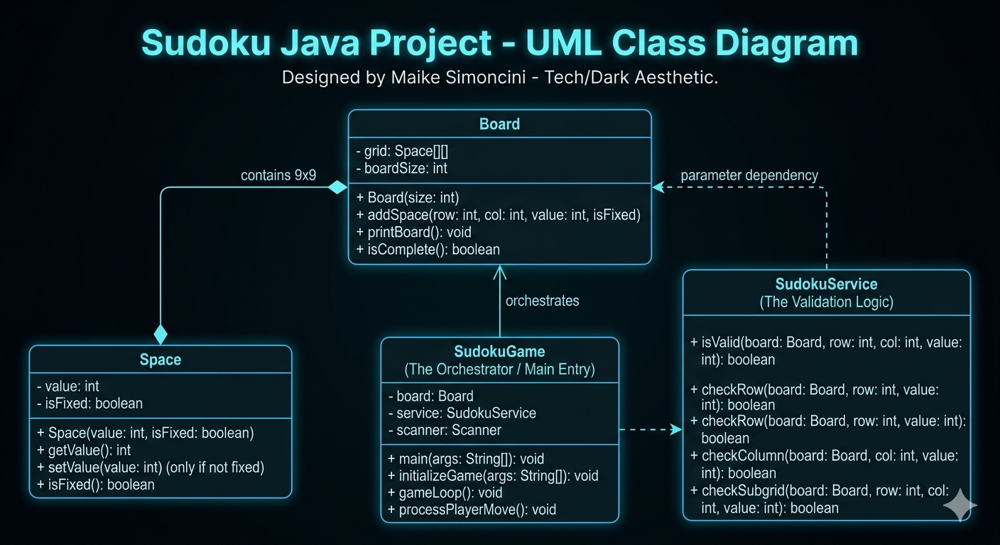

# 🧩 Sudoku Java CLI


Projeto desenvolvido como desafio prático na plataforma **DIO (Digital Innovation One)**. Este jogo de Sudoku interativo via terminal foi construído para consolidar os fundamentos de **Programação Orientada a Objetos (POO)**, manipulação de matrizes e algoritmos de validação.

## 🚀 Sobre o Projeto
Este desafio exige a implementação de uma lógica robusta para garantir que as regras do Sudoku sejam seguidas rigorosamente. O tabuleiro é inicializado dinamicamente através de argumentos de linha de comando, permitindo diferentes cenários de jogo.

### Principais Funcionalidades:
* **Parsing de Argumentos:** Converte strings complexas em objetos estruturados de jogo.
* **Motor de Validação:** Verificação lógica em 3 níveis (Linha, Coluna e Quadrante $3 \times 3$).
* **Persistência de Estado:** Diferenciação entre células fixas (originais) e inseridas pelo usuário.
* **Interface Interativa:** Experiência otimizada para o console.

## 🏗️ Arquitetura do Sistema
Seguindo os princípios de *Clean Code* e responsabilidade única:

| Classe | Responsabilidade |
| :--- | :--- |
| `Main` | Ponto de entrada, processa argumentos e gerencia o loop principal. |
| `Board` | Gerencia a estrutura da matriz $9 \times 9$ e a exibição visual. |
| `Space` | Representa cada célula do tabuleiro (valor e imutabilidade). |
| `SudokuService` | Contém a inteligência de validação das regras do jogo. |

### Diagrama de Classes


## 🛠️ Tecnologias e Conceitos
* **Linguagem:** Java 17+
* **Paradigma:** Orientação a Objetos.
* **Estrutura de Dados:** Matrizes bidimensionais.
* **Lógica de Algoritmos:** Validação de sub-grades e tratamento de exceções.

## 📋 Como Executar
### Pré-requisitos
* Java JDK instalado e configurado.
### Execução via Terminal
1. Clone o repositório:
   ```bash
   git clone [https://github.com/Maike-Simoncini/sudoku-java-cli.git](https://github.com/Maike-Simoncini/sudoku-java-cli.git)
```
 2. Acesse a pasta e compile:
   ```bash
   javac src/*.java -d bin/
   
   ```
 3. Inicie o jogo com o cenário padrão:
   ```bash
   java -cp bin Main "0,0;4,false 1,0;7,false 2,0;9,true 3,0;5,false 4,0;8,true 5,0;6,true 6,0;2,true 7,0;3,false 8,0;1,false 0,1;1,false 1,1;3,true 2,1;5,false 3,1;4,false 4,1;7,true 5,1;2,false 6,1;8,false 7,1;9,true 8,1;6,true 0,2;2,false 1,2;6,true 2,2;8,false 3,2;9,false 4,2;1,true 5,2;3,false 6,2;7,false 7,2;4,false 8,2;5,true 0,3;5,true 1,3;1,false 2,3;3,true 3,3;7,false 4,3;6,false 5,3;4,false 6,3;9,false 7,3;8,true 8,3;2,false 0,4;8,false 1,4;9,true 2,4;7,false 3,4;1,true 4,4;2,true 5,4;5,true 6,4;3,false 7,4;6,true 8,4;4,false 0,5;6,false 1,5;4,true 2,5;2,false 3,5;3,false 4,5;9,false 5,5;8,false 6,5;1,true 7,5;5,false 8,5;7,true 0,6;7,true 1,6;5,false 2,6;4,false 3,6;2,false 4,6;3,true 5,6;9,false 6,6;6,false 7,6;1,true 8,6;8,false 0,7;9,true 1,7;8,true 2,7;1,false 3,7;6,false 4,7;4,true 5,7;7,false 6,7;5,false 7,7;2,true 8,7;3,false 0,8;3,false 1,8;2,false 2,8;6,true 3,8;8,true 4,8;5,true 5,8;1,false 6,8;4,true 7,8;7,false 8,8;9,false"
   
   ```
## 👤 Autor
**Maike Simoncini da Silva** *Tecnólogo em ADS | Aspirante a AI Engineer*
LinkedIn
GitHub
